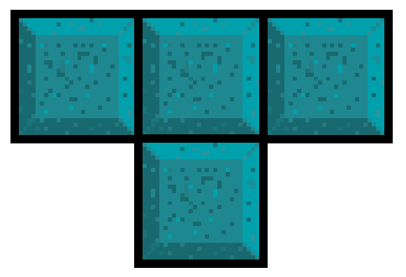
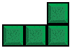
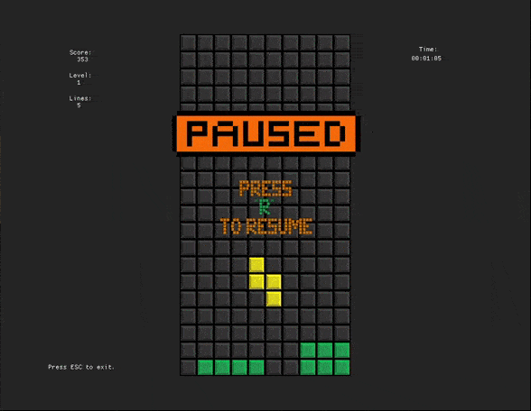
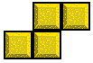
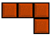
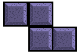
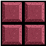



# UPuzzleGame
***
Classic and legendary fun block puzzle game
This game allows you to test your problem-solving skills even further, and with a variety of difficulty levels, it will provide hours of fun for all puzzle-lovers!



# Game process





# For Developers
### Data access information
- MiniKit Framework is protected by copyright

## Setup
1. Download or clone the source code
2. `cd` into the directory
3. load submodule
```bash
git submodule update --init
```
4. Build:
```bash
## on Windows
build_win32_vs2019.bat

## on OSX
sh build_macos.sh

```
5. Run:
```bash
## on Windows 
./build_win32/game/src/Debug/puzzle.exe

## on OSX
./build_macos/game/src/Debug/puzzle
```


# Project structure

```
CMakeLists.txt
├── minikit          # framework
    CMakeLists.txt
├── game                 # main sources / assets
    CMakeLists.txt
    ├── assets          # multimedia assets
    └── src            # sources
        CMakeLists.txt

```


# Usage
The controls:
* <kbd>←</kbd> and <kbd>→</kbd> : Move the tetromino left and right,
* <kbd>↑</kbd> : Rotate (clockwise) the tetromino,
* <kbd>↓</kbd> : Soft drop of the tetromino,
* <kbd>Esc</kbd> : Exit the game,
* <kbd>P</kbd> : Pause the game,
* <kbd>R</kbd> : Resume the game,
* <kbd>N</kbd> : Start new game



## Authors

* **Yevheniia Ksonzenko** - [GitHub page](https://github.com/yksonzenko)
